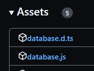

# Starting with Con-Databases
If you don't have experience with the Map build-in class, go get acquainted. Here: https://developer.mozilla.org/en-US/docs/Web/JavaScript/Reference/Global_Objects/Map

## Steps

### Downloading specific version
Pick your version what you want to use [here](https://github.com/Con-JS-Development/Con-Database/tags)


Then download your required files
- *(try downloading types for better experience)*



### Import and use!
- Place database files into your coding folder
- Import your required classes from database file
    ```js
    import {JsonDatabase} from "./database"; //import your downloaded file
    ```
Now you can just use, save and load your data
```js

const database = new JsonDatabase("my_database_id").load();

database.set("some key", "string data");
database.set("some key2", 645654);
database.set("some key3", ["array","array",{name:"object"}]);

database.get("some key2") - 645654;
database.get("some key") + " is useful";
database.remove("some key3");
```
## Example saving deaths for each player
Each key is unique to its player because key include players id, so database keys looks like
```
5648463deaths
6843684deaths
6545463deaths
```
Code
```js
import {world} from "@minecraft/server";

const stats = new JsonDatabase("playerStats").load();

world.afterEvents.entityDie.subscribe(({deadEntity})=>
    setDeaths(deadEntity,getDeaths(deadEntity) + 1);
,{entityTypes:["mineraft:player"]});


function getDeaths(player){ 
    return stats.get(player.id + "deaths")??0;}

function setDeaths(player,deaths){ 
    stats.set(player.id + "deaths",deaths);}
```